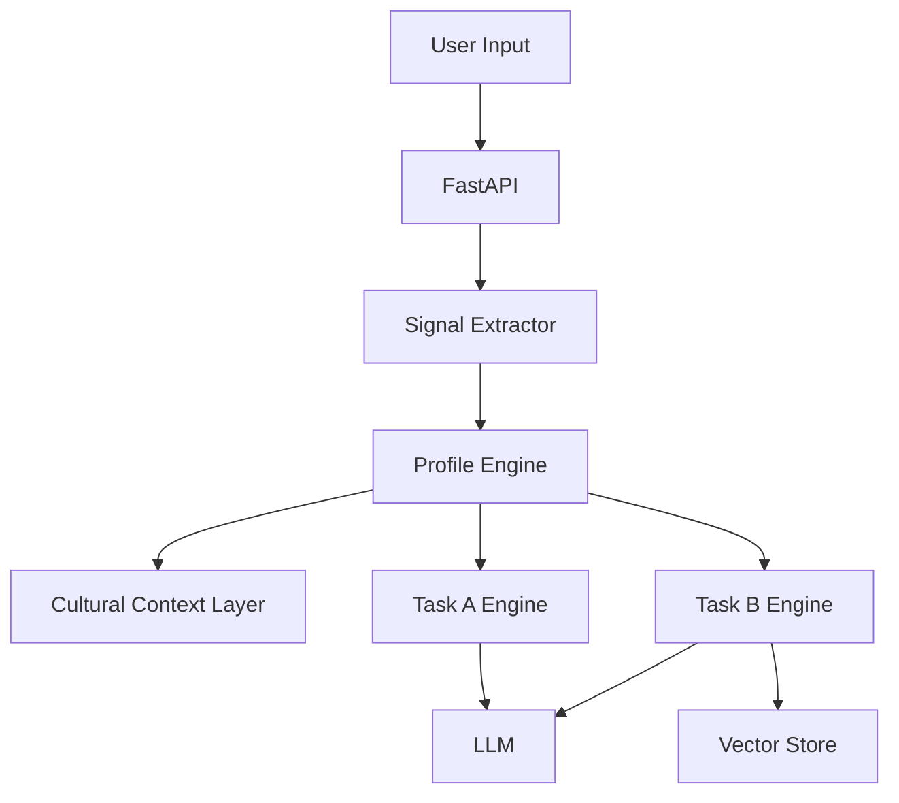

# Persona Backend AI/ML PRD

Owner: Backend AI/ML Developer
Last updated: 2026-05-20

## Goal

Deliver a backend system that constructs psychological profiles from sparse data and powers
Task A review simulation and Task B recommendations with explicit reasoning and Nigerian
contextualization.

## Success Criteria

- Profile engine produces stable, interpretable dimensions from minimal history.
- Task A rating RMSE improves over a mean-rating baseline.
- Task B ranking quality improves over popularity baseline.
- Cold-start with 3 to 4 answers produces usable recommendations.
- All endpoints respond within demo-friendly latency targets.

## Scope

In scope:
- Signal extraction and profile construction
- LLM prompts and reasoning pipelines
- Vector search and multi-angle retrieval
- Rating calibration and cultural enrichment
- API endpoints for Task A, Task B, and profile

Out of scope:
- Frontend UI implementation
- DevOps hosting beyond Docker Compose

## System Components

- Data Loader: Yelp, Amazon, Goodreads
- Signal Extractor: rating stats, stylometry, value hierarchy, temporal patterns
- Profile Engine: psychological profile JSON
- Cultural Context Layer: Nigerian English and code-switching signals
- Vector Store: ChromaDB for item embeddings
- Task A Engine: rating reasoning + review generation
- Task B Engine: agentic recommendation with deliberative ranking
- API: FastAPI endpoints

## Behavioral Twin Layers

- Taste Graph: cross-domain preference structure
- Vocabulary Fingerprint: stylometry and lexicon
- Rating Calibration: individual and cultural bias correction
- Cultural Context: Nigerian signals and phrasing preservation

## Task A Pipeline

Inputs:
- userId or user history
- item description

Steps:
1. Extract signals and build profile
2. Predict rating with explicit reasoning
3. Generate review constrained by profile
4. Apply cultural layer if Nigerian signals present

Outputs:
- predictedRating
- ratingReasoningTrace
- generatedReview

## Task B Pipeline

Inputs:
- userId or cold-start responses
- optional query context

Steps:
1. Build or update profile
2. Identify preference axes and constraints
3. Multi-angle retrieval from vector store
4. Deliberative scoring and conflict resolution
5. Produce ranked list and explanations

Outputs:
- recommendations with rank and explanation
- reasoningTrace

## Cold-Start Strategy

- 3 to 4 targeted questions to estimate key axes
- Bootstrap a thin profile and update incrementally
- Avoid popularity-only fallback; always reason from signals

## Data Processing

- Temporal split by user (80/20)
- Deduplicate users across datasets
- Feature extraction for rating and text stats
- Cultural enrichment via Nigerian signal dictionary

## Evaluation

Task A:
- ROUGE-L, BERTScore
- RMSE for rating prediction
- Human behavioral fidelity (demo validation)

Task B:
- NDCG@10, Hit Rate
- Cold-start and cross-domain performance

Ablation:
- Remove each behavioral layer and compare

## API Endpoints (High-Level)

- POST /profile/build
- POST /task-a/simulate
- POST /task-b/recommend
- POST /cold-start/answer

## Non-Functional Requirements

- P95 response under 2.5s for Task A
- P95 response under 3.5s for Task B
- Deterministic mode available for demos
- Structured logs for reasoning traces

## Dependencies

- LLM API access and rate limits
- Embedding model availability
- Dataset access and preprocessing pipeline

## Open Questions

- Which LLM is final for the demo (Claude vs fallback)?
- Target size of the reasoning trace per request?
- Should we cache profiles between sessions?

## Architecture Diagram

