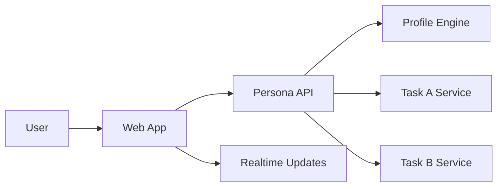

# Persona Frontend PRD

Owner: Frontend Developer
Last updated: 2026-05-20

## Goal

Build a production-quality web app for Persona that communicates the psychological profile, reasoning trace, and outputs for Task A and Task B with clarity and speed.

## Success Criteria

- Users can complete Task A and Task B flows end-to-end without confusion.
- Reasoning trace is visible and understandable before results are shown.
- Cold-start chat builds a profile live and updates the UI in real time.
- UI stays responsive on mid-range laptops and mobile devices.
- All key screens load in under 2 seconds on a typical broadband connection.

## Scope

In scope:
- Web app UI in React + TypeScript + Tailwind CSS.
- Visualization of psychological profile and rating trajectory.
- Reasoning trace panel, recommendation cards, and review comparison.
- Cold-start conversational onboarding.
- API integration with backend services.

Out of scope:
- Backend model implementation.
- Dataset preprocessing.
- Container orchestration.

## Target Users

- Hackathon judges and reviewers.
- Demo operators who need to show Task A and Task B quickly.

## UX Principles

- Show reasoning before output to emphasize agentic workflow.
- Make the profile feel like a living character, not a static vector.
- Keep outputs grounded in evidence (profile signals, constraints).
- Nigerian context cues should be visible but not caricatured.

## Information Architecture

Core routes:
- /: Landing and mode selection (Task A, Task B)
- /task-a: Review simulation flow
- /task-b: Recommendation flow
- /about: Method overview and architecture

Global UI components:
- App shell with mode switcher
- Profile summary panel (persistent when user selected)
- Status/trace panel
- Notifications and error toasts

## Task A Flow

Steps:
1. Select user (search or pick from curated list)
2. Profile loads and renders
3. Enter item description
4. View rating prediction reasoning
5. Generated review appears with type-out animation
6. Optional: reveal real review side by side

Required UI elements:
- User selector with search and filters
- Profile panel with radar chart and signal highlights
- Reasoning trace panel
- Review output panel with rating badge
- Side-by-side comparison drawer

## Task B Flow

Steps:
1. Select user or start cold-start chat
2. Profile builds in real time
3. Reasoning trace shows preference axes and constraints
4. Ranked recommendations appear with explanations
5. User refines with new constraints; list re-ranks

Required UI elements:
- Cold-start chat panel
- Preference axes list
- Constraints list
- Recommendation card grid
- Explanation accordion per card

## Key Screens

- Landing
- Task A
- Task B
- About
- Empty and error states

## Data Contracts

Frontend expects these response shapes (high-level, non-code):

Profile Summary:
- userId, displayName
- ratingStats, writingFingerprint, valueHierarchy
- culturalSignals, trajectoryHighlights
- preferenceAxes, constraints

Task A Output:
- predictedRating
- ratingReasoningTrace
- generatedReview
- realReview (optional)

Task B Output:
- recommendations: list of items with rank, explanation, confidence
- reasoningTrace

## Visual Design Direction

- Bold, research-lab aesthetic with high contrast and warm neutrals.
- Custom typography (avoid system defaults).
- Subtle animated gradients or textured background.
- Motion used to reveal reasoning steps and profile building.

## Accessibility

- All interactive elements keyboard-navigable.
- Contrast ratio of at least 4.5:1 for body text.
- Animations can be reduced with prefers-reduced-motion.

## Performance

- Code-splitting by route.
- Virtualize long lists (recommendations or trace logs).
- Lazy-load charts and heavy UI modules.

## Dependencies

- Backend API availability and stable contracts.
- Sample datasets for seeded demo users.

## Open Questions

- Final list of curated demo users and sample items?
- What is the target maximum length for reasoning traces?
- Should the app support multi-language UI or just English?

## Architecture Diagram

